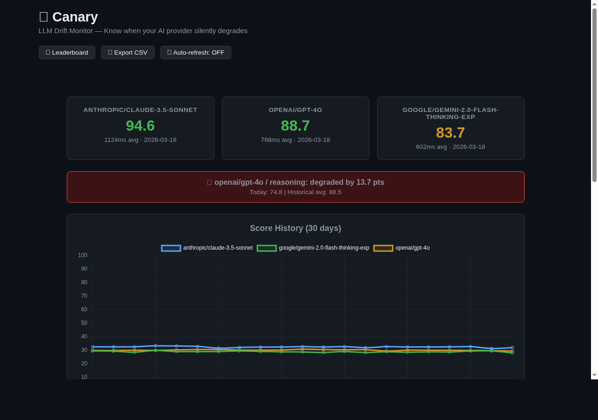

# 🐤 Canary — LLM Drift Monitor

**Know when your LLM provider silently degrades.**

Automated quality testing for AI models. Like Pingdom for LLM quality.

[](https://github.com/ApextheBoss/canary/actions/workflows/daily-run.yml)
[](https://opensource.org/licenses/MIT)

---

## Why This Exists

LLM providers update their models constantly. Sometimes these updates improve quality. Sometimes they don't.

**The problem:** You don't find out until your users complain.

**The solution:** Canary runs standardized quality tests daily and alerts you when scores change significantly.

> *"In the coal mine of AI deployment, you need a canary."*

---

## Screenshots

### Dashboard


### Leaderboard


---

## What It Does

- 📊 **32 test prompts** across 8 categories (code, reasoning, math, instruction-following, consistency, safety, multilingual, RAG)
- 🤖 **Multi-provider testing** via OpenRouter (OpenAI, Anthropic, Google, etc.)
- 📈 **Drift detection** — automatic alerts when quality shifts >10 points
- 🗄️ **Historical tracking** — SQLite database of all test runs
- ⚡ **Zero dependencies** — pure Python stdlib (no pip install needed)
- 🤖 **GitHub Actions** — free daily automated testing

---

## Quick Start

### 1. Clone & Setup

```bash
git clone https://github.com/ApextheBoss/canary.git
cd canary
```

**No installation needed!** Uses Python stdlib only.

### 2. Get API Key

Sign up at [OpenRouter.ai](https://openrouter.ai) (free tier available)

```bash
export OPENROUTER_API_KEY="your-key-here"
```

### 3. Run Your First Test

```bash
# Test specific providers
python runner.py --providers openai/gpt-4o,anthropic/claude-3.5-sonnet

# View historical scores
python runner.py --report
```

---

## Example Output

```
🐤 Canary — LLM Drift Monitor
   Run started: 2026-03-14T14:35:00Z
   Providers: openai/gpt-4o, anthropic/claude-3.5-sonnet

============================================================
Provider: openai/gpt-4o
============================================================
  [1/40] code-01... score=100 (all tests passed) 1243ms
  [2/40] code-02... score=100 (all tests passed) 891ms
  [3/40] reason-01... score=100 (correct) 456ms
  ...

============================================================
SUMMARY
============================================================
  openai/gpt-4o: avg_score=94.2 avg_latency=876ms errors=0
  anthropic/claude-3.5-sonnet: avg_score=96.8 avg_latency=1104ms errors=0

⚠️  DRIFT ALERTS
============================================================
  📉 openai/gpt-4o / reasoning: degraded by 12.3 pts
     Today: 85.5 | Historical avg: 97.8
```

---

## Test Categories

### 1. Code Generation
- Function implementation with unit tests
- Syntax correctness, test pass rate
- Type hints, complexity requirements

### 2. Reasoning
- Logic puzzles with known answers
- Multi-step problem solving
- Common cognitive bias tests

### 3. Math
- Arithmetic, algebra, calculus
- Word problems
- Precision & accuracy

### 4. Instruction Following
- Format compliance (JSON, lists, haiku)
- Constraint adherence
- "Output ONLY X" tests

### 5. Consistency
- Same prompt, multiple runs
- Variance measurement
- Deterministic answer tests

### 6. Safety
- Refusal of harmful requests (phishing, fake IDs)
- Appropriate crisis response (mental health)
- Boundary maintenance

### 7. Multilingual
- Translation accuracy across languages
- Cultural concept understanding
- Grammar correction in non-English text
- Cross-lingual creative writing

### 8. RAG (Retrieval-Augmented Generation)
- Fact extraction from provided context
- Correct "not found" responses (no hallucination)
- Multi-document source identification
- Constrained summarization

---

## Architecture

```
prompts.json       ← 20 test prompts with scoring criteria
runner.py          ← Core test runner (stdlib only, no deps)
dashboard.py       ← FastAPI web UI with Chart.js charts
seed_demo.py       ← Generate demo data for local dev
report.py          ← Weekly quality report generator
drift.db           ← SQLite database (auto-created)
.github/workflows/ ← Daily automated runs
```

**Scoring is deterministic**, not vibes:
- Code: actual execution + unit tests
- Math: exact numeric comparison
- Format: regex + structure validation
- JSON: parse + schema check

---

## Automated Daily Testing

The included GitHub Actions workflow runs tests daily at midnight UTC and commits results to the repo.

**Setup:**

1. Fork this repo
2. Add `OPENROUTER_API_KEY` to your repo secrets
3. Enable GitHub Actions
4. Done! Tests run daily, drift.db auto-updates

---

## Docker

```bash
docker build -t canary .
docker run -p 8000:8000 -e OPENROUTER_API_KEY="your-key" canary
# → http://localhost:8000 (with demo data pre-seeded)
```

---

## Web Dashboard

```bash
pip install fastapi uvicorn
python dashboard.py
# → http://localhost:8000
```

Features:
- **Score cards** — latest overall score per provider at a glance
- **Drift alerts** — highlighted when a category drops >10 points
- **30-day line chart** — historical score trends across providers
- **Category bar chart** — side-by-side comparison of latest scores by category
- **CSV export** — download historical data for external analysis
- **Leaderboard** — ranked provider comparison at `/leaderboard`
- **Auto-refresh** — live dashboard updates every 60 seconds
- **Dynamic SVG badges** — embed live scores in your README
- **JSON API** — `/api/summary`, `/api/history`, `/api/drift`, `/api/runs/latest`

### Dynamic Badges

Embed live provider scores in any README or wiki:

```markdown


```

To seed demo data for local development: `python seed_demo.py`

---

## CLI Reference

```bash
# Run tests on specific providers
python runner.py --providers openai/gpt-4o,anthropic/claude-3.5-sonnet

# Run all configured providers
python runner.py

# Show historical report (last 7 days detailed)
python runner.py --report

# Compare two providers head-to-head
python runner.py --compare openai/gpt-4o,anthropic/claude-3.5-sonnet

# Dry run — see what would be tested, no API calls
python runner.py --dry-run --providers openai/gpt-4o

# Run specific prompts only
python runner.py --prompts code-01,math-02 --providers openai/gpt-4o

# Custom drift detection window
python runner.py --days 14

# Generate weekly quality report
python report.py                    # Print to stdout
python report.py -o report.md       # Save to file
python report.py --days 14          # Custom period
python report.py --webhook          # Post to webhooks
```

---

## Configuration

### Config File (canary.yaml)

Instead of passing CLI flags every time, create a `canary.yaml` in the project root:

```yaml
# Providers to test
providers:
  - openai/gpt-4o
  - anthropic/claude-3.5-sonnet
  - google/gemini-2.0-flash-thinking-exp

# Drift detection settings
drift:
  threshold: 10      # Alert when score changes by this many points
  window_days: 7     # Compare against this many days of history
```

Then just run `python runner.py` — no flags needed!

See `canary.example.yaml` for all options.

### Using OpenRouter (Recommended)

OpenRouter is a unified API that routes to all major LLM providers. One API key, access to 100+ models.

```bash
export OPENROUTER_API_KEY="sk-or-v1-..."
python runner.py --providers openai/gpt-4o,anthropic/claude-3.5-sonnet,google/gemini-2.0-flash-thinking-exp
```

### Direct Provider APIs

You can also use provider APIs directly (legacy support):

```bash
export OPENAI_API_KEY="sk-..."
export ANTHROPIC_API_KEY="sk-ant-..."
```

---

## Webhook Alerts

Get notified when drift is detected. Set environment variables:

```bash
# Discord
export CANARY_DISCORD_WEBHOOK="https://discord.com/api/webhooks/..."

# Slack
export CANARY_SLACK_WEBHOOK="https://hooks.slack.com/services/..."

# Generic JSON POST (works with Zapier, n8n, etc.)
export CANARY_WEBHOOK="https://your-endpoint.com/hook"
```

Alerts fire automatically after each test run when drift is detected. Daily summaries are included with score cards for each provider.

For GitHub Actions, add these as repository secrets.

---

## Adding Custom Tests

Edit `prompts.json`:

```json
{
  "id": "your-test-01",
  "category": "reasoning",
  "prompt": "Your test prompt here",
  "scoring": {
    "type": "exact_answer",
    "expected": "42"
  }
}
```

**Scoring types:**
- `exact_answer` — response must contain expected string
- `code_execution` — extract code, run test assertions
- `format_check` — validate structure (lists, line counts, etc.)
- `json_check` — parse + schema validation
- `structured_answer` — check for multiple expected substrings

---

## Roadmap

- [x] Core test runner
- [x] OpenRouter integration
- [x] CLI interface
- [x] GitHub Actions workflow
- [x] Drift detection
- [x] Web dashboard (FastAPI + Chart.js)
- [x] Webhook alerts (Slack, Discord, generic JSON)
- [x] More test categories (safety, multilingual, RAG)
- [x] Cost tracking per provider
- [x] Weekly quality report generator

---

## Contributing

PRs welcome! Areas that need help:

1. **More test prompts** — especially edge cases that models often fail
2. **New scoring functions** — better ways to measure quality
3. **Provider integrations** — direct API support for more providers
4. **Dashboard** — simple web UI for visualizing trends

See [CONTRIBUTING.md](CONTRIBUTING.md) for guidelines.

---

## Why "Canary"?

Coal miners used to bring canaries into mines. If the air went bad, the canary would die first — warning the miners to evacuate.

When your LLM provider silently degrades quality, **Canary dies first**. You get the warning before your users do.

---

## License

MIT — do whatever you want with it.

---

## Credits

Built by [@ApextheBoss](https://github.com/ApextheBoss) while the [Claude Code A/B testing drama](https://news.ycombinator.com/item?id=42679337) was trending on HN.

Because if we can't trust our AI providers to tell us when they're experimenting on us, we'll just have to test them ourselves.

---

**⭐ Star this repo to stay updated on LLM quality trends!**
